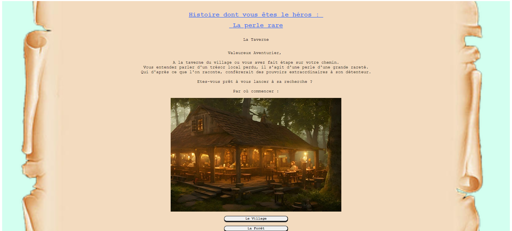

# La Perle Rare

Projet de type "Livres dont vous êtes le héros"
Le principe, vos actions déterminent l'histoire.

Réaliser dans le cadre du dernier checkpoint avec la Wild Code School de Reims.
Reprenant tout ce que l'on a appris durant les 5 mois de la formation (février - juillet 20223).
Réalisation individuelle en 2 jours au mois de juillet 2023.

## Concept

Ce template est conçu pour servir de base à tous les projets (P2/P3) suivants la stack React-Node-MySQL telle qu'enseignée à la Wild Code School. Il est préconfiguré avec un ensemble d'outils qui aideront les élèves à produire un code correspondant mieux aux standards du monde du travail et plus facile à maintenir, tout en restant simple à utiliser.

## Installation & Utilisation

### Pour commencer un projet

- Sur VSCode, installer les plugins **Prettier - Code formatter** et **ESLint** et les configurer
- Cloner ce dépôt, se rendre à l'intérieur
- Si vous utilisez `yarn` ou `pnpm`, adapter `config/cli` dans le fichier `package.json`
- Lancer la commande `npm install`
- _NB: Pour exécuter le backend, un fichier d'environnement avec les données de connexion d'une BdD valide est nécesaire. Un modèle se trouve dans `backend/.env.sample`_

### Liste des commandes et signification

- `migrate` : Exécute le script de création de la base de données
- `dev` : Démarrage des deux serveurs (frontend + backend) dans un même terminal
- `dev-front` : Démarrage d'un serveur React pour le frontend
- `dev-back` : Démarrage d'un serveur Express pour le backend
- `lint` : Exécute des outils de validation de code (sera exécutée automatiquement à chaque _commit_)
- `fix` : Fixe les erreurs de formatage (à lancer si `lint` ne passe pas)

## Pour plus d'informations

### Listing des outils utilisés

- _Concurrently_ : Permet d'exécuter plusieurs commandes dans un même terminal
- _Husky_ : Permet d'exécuter des actions en déclenchement de commandes _git_
- _Vite_ : Alternative à _Create-React-App_, embarquant moins de packages pour une expérience plus fluide
- _ESLint_ : Outil de "qualité de code", permet de s'assurer que des règles pré-configurées sont bien respectées
- _Prettier_ : Outil de "qualité de code" également, se concentre plus particulièrement sur le style du code
- _Standard Airbnb_ : L'un des "standards" les plus connus, même s'il n'est pas officiellement lié à ES/JS
- _Nodemon_ : Outil permettant de relancer un serveur à chaque fois qu'un des fichiers est modifié
